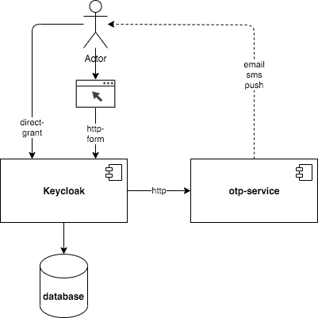
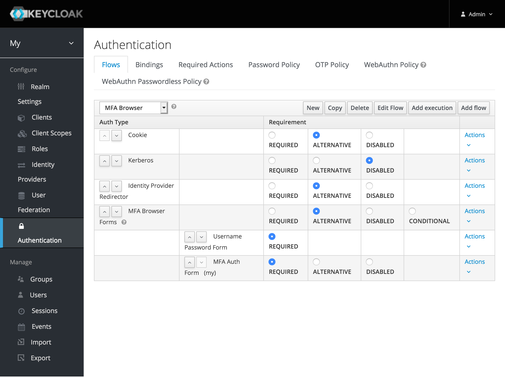
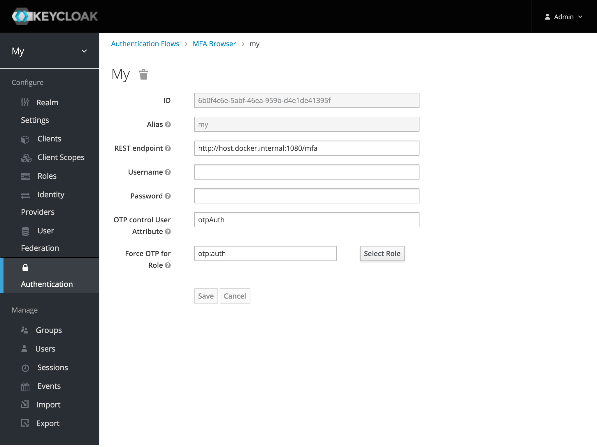
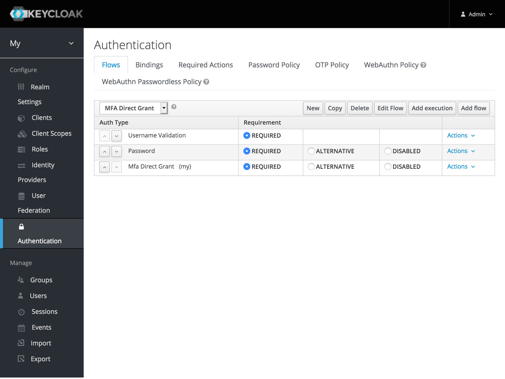

# mfa-auth

Multi-Factor-Authenticaton with generic REST endpoint.

## Overview 

## Config

Browser

Direct-Grant

## API 

The REST Endpoint handles:
- OTP Code Generation 
- Sending the OTP back to the user
- Retries, Expiry and Validation

For documentation of the API and a sample implementation please check [keycloak-ldap][].

[keycloak-ldap]: https://github.com/spurreiter/keycloak-ldap/docs/mfa-api.md